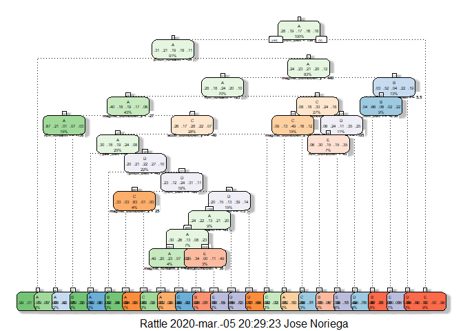

## Summary

The goal of this project is to predict the variable "classe",in the data set: "Weight Lifting Exercise", which is a sample of the manner users exercises. We are going to present how we built our models, select few to make our prediction, how we made cross validation and expectations. Finally we are going to use our final prediction model to predict 20 different test cases.
The data for this project come from this source: http://groupware.les.inf.puc-rio.br/har.

## Exploratory Data and Upload necessary libraries

Staring with setting the working directory,loading libraries and the upload of the data training and testing


```r
library(lattice);library(ggplot2);library(bitops);library(rpart);library(rpart.plot)
library(rattle);library(caret);library(randomForest);library(ggplot2)
library(AppliedPredictiveModeling);library(dplyr)

Training<-read.csv("pml-training.csv",strip.white = TRUE,na.strings = c("NA",""))
Testing<-read.csv("pml-testing.csv",strip.white = TRUE,na.strings = c("NA",""))
dim(Training)
```

```
## [1] 19622   160
```

```r
dim(Testing)
```

```
## [1]  20 160
```
As Training and Testing data have the same variables (160), we are going to clean the missing data.

## Cleaning the Data


```r
features<-names(Testing[,colSums(is.na(Testing))==0])[8:59]
Training<-Training[,c(features,"classe")]
Testing<-Testing[,c(features,"problem_id")]
dim(Training)
```

```
## [1] 19622    53
```

```r
dim(Testing)
```

```
## [1] 20 53
```

## Partitioning the data


```r
set.seed(1234)
inTrain<-createDataPartition(y=Training$classe,p=0.6,list = FALSE)
training<-Training[inTrain,]
testing<-Training[-inTrain,]
dim(training)
```

```
## [1] 11776    53
```

```r
dim(testing)
```

```
## [1] 7846   53
```

# Analysis different Models

## Random Forest Model

```r
set.seed(1234)
RandomForrest<-randomForest(classe ~ .,training, ntree=100)
RandomForrest
```

```
## 
## Call:
##  randomForest(formula = classe ~ ., data = training, ntree = 100) 
##                Type of random forest: classification
##                      Number of trees: 100
## No. of variables tried at each split: 7
## 
##         OOB estimate of  error rate: 0.78%
## Confusion matrix:
##      A    B    C    D    E class.error
## A 3340    6    2    0    0 0.002389486
## B   15 2254   10    0    0 0.010969724
## C    0   16 2034    4    0 0.009737098
## D    0    1   26 1901    2 0.015025907
## E    0    0    2    8 2155 0.004618938
```

```r
RandomForrestPred<-predict(RandomForrest,newdata = testing,type = "class")
confusionMatrix(RandomForrestPred,testing$classe)
```

```
## Confusion Matrix and Statistics
## 
##           Reference
## Prediction    A    B    C    D    E
##          A 2232   12    0    0    0
##          B    0 1502    9    0    0
##          C    0    2 1352   12    4
##          D    0    0    7 1272    5
##          E    0    2    0    2 1433
## 
## Overall Statistics
##                                           
##                Accuracy : 0.993           
##                  95% CI : (0.9909, 0.9947)
##     No Information Rate : 0.2845          
##     P-Value [Acc > NIR] : < 2.2e-16       
##                                           
##                   Kappa : 0.9911          
##                                           
##  Mcnemar's Test P-Value : NA              
## 
## Statistics by Class:
## 
##                      Class: A Class: B Class: C Class: D Class: E
## Sensitivity            1.0000   0.9895   0.9883   0.9891   0.9938
## Specificity            0.9979   0.9986   0.9972   0.9982   0.9994
## Pos Pred Value         0.9947   0.9940   0.9869   0.9907   0.9972
## Neg Pred Value         1.0000   0.9975   0.9975   0.9979   0.9986
## Prevalence             0.2845   0.1935   0.1744   0.1639   0.1838
## Detection Rate         0.2845   0.1914   0.1723   0.1621   0.1826
## Detection Prevalence   0.2860   0.1926   0.1746   0.1637   0.1832
## Balanced Accuracy      0.9989   0.9940   0.9928   0.9936   0.9966
```

## Decision Tree Model


```r
modFit<-rpart(classe~.,training,method="class")
fancyRpartPlot(modFit,cex=0.4)
```

```
## Warning: labs do not fit even at cex 0.15, there may be some overplotting
```

<!-- -->

```r
prediction<-predict(modFit, testing, type = "class")
confusionMatrix(prediction,testing$classe)
```

```
## Confusion Matrix and Statistics
## 
##           Reference
## Prediction    A    B    C    D    E
##          A 1930  231   47   81   53
##          B   82  866   67  103  121
##          C   59  189 1062  173  134
##          D   94  118   85  821   70
##          E   67  114  107  108 1064
## 
## Overall Statistics
##                                          
##                Accuracy : 0.732          
##                  95% CI : (0.722, 0.7417)
##     No Information Rate : 0.2845         
##     P-Value [Acc > NIR] : < 2.2e-16      
##                                          
##                   Kappa : 0.6605         
##                                          
##  Mcnemar's Test P-Value : < 2.2e-16      
## 
## Statistics by Class:
## 
##                      Class: A Class: B Class: C Class: D Class: E
## Sensitivity            0.8647   0.5705   0.7763   0.6384   0.7379
## Specificity            0.9266   0.9411   0.9143   0.9441   0.9382
## Pos Pred Value         0.8241   0.6990   0.6568   0.6911   0.7288
## Neg Pred Value         0.9451   0.9013   0.9509   0.9302   0.9408
## Prevalence             0.2845   0.1935   0.1744   0.1639   0.1838
## Detection Rate         0.2460   0.1104   0.1354   0.1046   0.1356
## Detection Prevalence   0.2985   0.1579   0.2061   0.1514   0.1861
## Balanced Accuracy      0.8957   0.7558   0.8453   0.7912   0.8380
```

## Generalized BoostedRegression Model

```r
Ctrlmodgb<-trainControl(method = "repeatedcv",number = 5,repeats = 2)
modgbm<-train(classe~., data = training,method="gbm",trControl=Ctrlmodgb,verbose=FALSE)
predictgbm<-predict(modgbm,newdata=testing)
confusionMatrix(predictgbm,testing$classe)
```

```
## Confusion Matrix and Statistics
## 
##           Reference
## Prediction    A    B    C    D    E
##          A 2190   41    0    0    3
##          B   24 1432   44    5   25
##          C   11   38 1303   40   17
##          D    5    2   19 1227   23
##          E    2    5    2   14 1374
## 
## Overall Statistics
##                                           
##                Accuracy : 0.9592          
##                  95% CI : (0.9546, 0.9635)
##     No Information Rate : 0.2845          
##     P-Value [Acc > NIR] : < 2.2e-16       
##                                           
##                   Kappa : 0.9484          
##                                           
##  Mcnemar's Test P-Value : 1.217e-08       
## 
## Statistics by Class:
## 
##                      Class: A Class: B Class: C Class: D Class: E
## Sensitivity            0.9812   0.9433   0.9525   0.9541   0.9528
## Specificity            0.9922   0.9845   0.9836   0.9925   0.9964
## Pos Pred Value         0.9803   0.9359   0.9248   0.9616   0.9835
## Neg Pred Value         0.9925   0.9864   0.9899   0.9910   0.9895
## Prevalence             0.2845   0.1935   0.1744   0.1639   0.1838
## Detection Rate         0.2791   0.1825   0.1661   0.1564   0.1751
## Detection Prevalence   0.2847   0.1950   0.1796   0.1626   0.1781
## Balanced Accuracy      0.9867   0.9639   0.9681   0.9733   0.9746
```

## Conclusion

The prediction accuracy resulting for the three model are:
Desicion Tree Model: 73,20 %
Generalized Boosted Model:95.92%
Random Forrest Model: 99,30%

Considering that Random Forrest Model provided more accuracy results, we consider it for our final prediction of 20 different test cases


```r
RandomForrestPred<-predict(RandomForrest,newdata = testing,type = "class")
RandomForrestPred
```


```r
# [1] B A B A A E D B A A B C B A E E A B B B
# Levels: A B C D E
```
 


